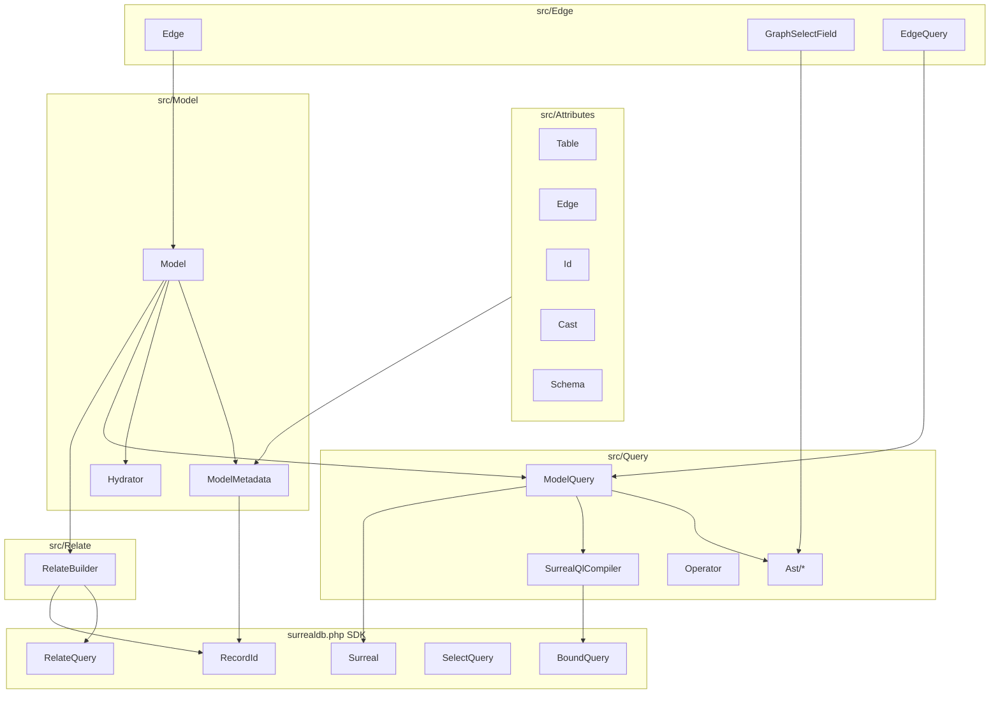
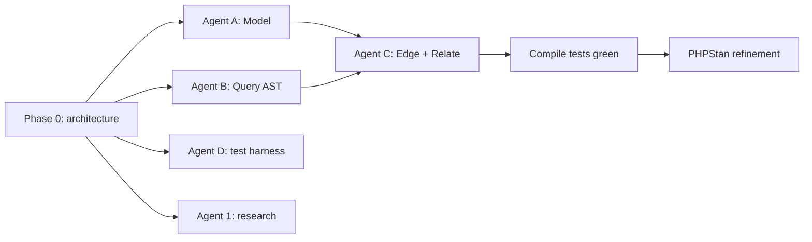

# surqlize.php — Architecture

SurrealDB ORM for PHP. Sits on top of `surrealdb/surrealdb.php` (SDK) and exposes
attribute-driven `Model` / `Edge` classes with an AST-based query compiler.

**Design spec:** [`design-table-and-edge-models.md`](../design-table-and-edge-models.md)

---

## Package identity

| Key | Value |
|-----|-------|
| Composer name | `surqlize/surqlize` |
| Root namespace | `Surqlize\` |
| PHP | `>=8.4` |
| SDK dependency | `surrealdb/surrealdb.php` (path repo or packagist) |

---

## Directory layout

```
surqlize.php/
├── composer.json
├── phpstan.neon                    # Agent 6 / refinement pass
├── phpunit.xml.dist
├── design-table-and-edge-models.md
├── docs/
│   ├── architecture.md             # this file
│   ├── open-questions.md
│   └── research.md                 # Agent 1
├── src/
│   ├── Attributes/                 # Agent A — PHP 8.4 attributes
│   │   ├── Table.php
│   │   ├── Edge.php
│   │   ├── Id.php
│   │   ├── Cast.php
│   │   └── Schema.php
│   ├── Model/                      # Agent A
│   │   ├── Model.php
│   │   ├── ModelMetadata.php
│   │   ├── ModelRegistry.php
│   │   ├── Hydrator.php
│   │   └── SchemaContract.php
│   ├── Query/                      # Agent B
│   │   ├── Operator.php
│   │   ├── Ast/
│   │   │   ├── Node.php
│   │   │   ├── SelectStatement.php
│   │   │   ├── WhereClause.php
│   │   │   ├── FieldSelection.php
│   │   │   ├── GraphTraversal.php
│   │   │   └── FetchClause.php
│   │   ├── Compiler/
│   │   │   └── SurrealQlCompiler.php
│   │   ├── ModelQuery.php
│   │   └── Concerns/
│   │       ├── BuildsSelect.php
│   │       └── CompilesQueries.php
│   ├── Edge/                       # Agent C
│   │   ├── Edge.php
│   │   ├── EdgeMetadata.php
│   │   ├── EdgeQuery.php
│   │   └── GraphSelectField.php
│   ├── Relate/                     # Agent C
│   │   ├── RelateBuilder.php
│   │   └── Time.php
│   └── Connection/
│       └── ConnectionManager.php   # holds SDK Surreal instance; v1 stub OK
└── tests/
    ├── TestCase.php                # Agent D
    ├── Fixtures/                   # Agent D
    │   ├── Address.php
    │   ├── User.php
    │   ├── HasAddress.php
    │   ├── AddressSchema.php
    │   ├── UserSchema.php
    │   └── HasAddressSchema.php
    └── Unit/
        ├── Model/                  # Agent A tests (or Agent D)
        ├── Query/                  # Agent D — compile tests
        ├── Edge/                   # Agent D
        └── Relate/                 # Agent D
```

---

## Agent ownership (no file overlap)

| Agent | Owns | Must not edit |
|-------|------|---------------|
| A — Model | `src/Attributes/`, `src/Model/` | `src/Query/`, `src/Edge/`, `src/Relate/`, `tests/` |
| B — Query | `src/Query/` | `src/Model/`, `src/Edge/`, `src/Relate/`, `tests/` |
| C — Edge/Relate | `src/Edge/`, `src/Relate/` | `src/Model/`, `src/Query/`, `tests/` |
| D — Tests | `tests/`, `phpunit.xml.dist` | `src/` (except reading) |
| 1 — Research | `docs/research.md` only | all `src/`, `tests/` |

Conflicts → `docs/open-questions.md`.

---

## Dependency graph



**Layer rules:**
1. `Model` never builds SurrealQL strings — delegates to `ModelQuery` → AST → `SurrealQlCompiler`.
2. `Edge` extends `Model`; edge-specific traversal lives in `GraphSelectField` (AST node).
3. `RelateBuilder` wraps SDK `RelateQuery` after resolving `RecordId`s from model instances.
4. Execution path: `collect()` → compile AST → `Surreal::query()` or SDK `SelectQuery` wrapper.

---

## Core interfaces

### SchemaContract

```php
namespace Surqlize\Model;

interface SchemaContract
{
    /** SurrealDB DEFINE TABLE / FIELD statements for this model. */
    public function definitions(): array;

    /** Optional validation rules applied before persist. */
    public function rules(): array;
}
```

### Compilable (query surface)

```php
namespace Surqlize\Query\Concerns;

interface CompilesQueries
{
    public function compile(): string;
}
```

### Node (AST root contract)

```php
namespace Surqlize\Query\Ast;

interface Node
{
    /** Produce canonical SurrealQL fragment for this node. */
    public function compile(): string;
}
```

---

## Model layer

### `Model` (abstract)

Responsibilities:
- Static metadata via `ModelMetadata::for(static::class)` (cached reflection).
- `static select(array $fields): ModelQuery`
- `static relate(Model $from): RelateBuilder` — overloads per design doc.
- Instance state: public typed properties only (no magic `__get`).
- `toArray(): array` for serialization toward SDK mutations.

### `ModelMetadata`

Resolved once per class from attributes:

| Attribute | Maps to |
|-----------|---------|
| `#[Table('user')]` | `tableName: string` |
| `#[Schema(UserSchema::class)]` | `schemaClass: class-string<SchemaContract>` |
| `#[Id]` on property | `idProperty: string`, `idKind: IdKind` (v1: inferred from `RecordId` only) |
| `#[Cast(Address::class)]` on property | entry in `casts: array<string, class-string<Model>>` |

### `Hydrator`

- `hydrate(string $class, array $row): Model`
- Recursively applies `Cast` metadata.
- Parses `id` fields through `RecordId::parse()` when string.

---

## Query layer (AST-based)

### Entry: `ModelQuery`

```php
final class ModelQuery implements CompilesQueries
{
    public function __construct(
        private readonly string $modelClass,
        private SelectStatement $ast,
        private ?QueryExecutor $executor = null,
    ) {}

    public static function for(string $modelClass, array $fields): self;

    public function where(string $field, Operator|string $op, mixed $value): self;
    public function fetch(string|array $fields): self;
    public function collect(): array;

    public function compile(): string;
}
```

`where()` accepts `Operator::EQUALS` or raw operator strings (`'>'`) for edge query examples.

### AST nodes

| Node | Compiles to |
|------|-------------|
| `SelectStatement` | `SELECT … FROM … WHERE … FETCH …` |
| `FieldSelection` | field list, including graph fields |
| `GraphTraversal` | `->edge->table[WHERE …]` chains |
| `WhereClause` | `WHERE field op value` (AND-combined) |
| `FetchClause` | `FETCH field` |

### `GraphSelectField` (in Edge package, implements `Node`)

```php
Edge::out(HasAddress::class)
    ->out(Address::class, fn (ModelQuery $q) => $q->where('postcode', 'INCLUDES', '24'))
    ->as('address')
    ->fetch();
```

Compiles: `->has_address->address[WHERE postcode INCLUDES '24'] AS address`

Direction:
- `out()` → `->`
- `in()` → `<-`

### `Operator` enum

```php
enum Operator: string
{
    case EQUALS = '=';
    case NOT_EQUALS = '!=';
    case GREATER_THAN = '>';
    case GREATER_THAN_OR_EQUAL = '>=';
    case LESS_THAN = '<';
    case LESS_THAN_OR_EQUAL = '<=';
    case INCLUDES = 'INCLUDES';
    case CONTAINS = 'CONTAINS';
    case LIKE = 'LIKE';
    // extend per SurrealDB docs
}
```

### `SurrealQlCompiler`

Walks AST, produces **exact** SurrealQL string. No parameter binding in v1 compile
tests (literal escaping only); execution may delegate to SDK `BoundQuery` later.

---

## Edge layer

### `Edge` (abstract, extends `Model`)

- `#[Edge('has_address', in: User::class, out: Address::class)]` on class.
- Reserved properties: `in`, `out` (SurrealDB edge endpoints).
- `in(): EdgeQuery` — starts query from `<-` direction.
- `out(): EdgeQuery` — starts query from `->` direction.
- Custom instance methods (e.g. `hasUserOverAge`) compose `in()->select()->where()->collect()`.

### `EdgeQuery`

Extends `ModelQuery` with direction context for `in`/`out` field selection.

### Static `Edge::out(HasAddress::class)` in SELECT

Factory on `Edge` class used inside `Model::select([...])` field list; returns
`GraphSelectField` builder.

---

## Relate layer

### `RelateBuilder`

Single call pattern (model-first):

```php
User::relate($user)->edge(HasAddress::class)->with($address)->execute();
```

`relate()` accepts a `Model` instance only (the edge `in` endpoint). `with()` sets the `out` endpoint.

Resolves:
- `RecordId` from persisted models (`$model->id` must be set).
- Edge table name from `EdgeMetadata`.
- Delegates to SDK `RelateQuery` for `CONTENT`, `TIMEOUT`, compile, execute.

### `Time` enum

```php
enum Time: string
{
    case Seconds = 's';
    case Minutes = 'm';
    case Hours = 'h';
}
```

`timeout(30, Time::Seconds)` → `TIMEOUT 30s`

---

## Design-doc → SurrealQL mapping (compile contract)

| PHP call | Expected SurrealQL |
|----------|-------------------|
| `User::select(['name'])->where('name', Operator::EQUALS, 'beau')->compile()` | `SELECT name FROM user WHERE name = "beau"` |
| `HasAddress::…->in()->select(['name'])->where('age', '>', 27)->compile()` | `SELECT name FROM user WHERE age > 27` |
| `…->selectValue('name')->…` | `SELECT VALUE name FROM user WHERE age > 27` |
| Graph select + fetch (design doc) | `SELECT name, ->has_address->address[WHERE postcode INCLUDES '24'] AS address WHERE name = "beau" FETCH address` |
| `HasAddress::select(['in','out'])->fetch(['in','out'])->compile()` | `SELECT in, out FROM has_address FETCH in, out` |
| `User::relate($user)->edge(HasAddress::class)->with($address)->content([...])->compile()` | `RELATE user:…->has_address->address:… CONTENT { … }` |
| `…->timeout(30, Time::Seconds)->compile()` | `… TIMEOUT 30s` |

---

## SDK integration

| ORM concern | SDK type |
|-------------|----------|
| Record IDs | `SurrealDB\SDK\Types\RecordId` |
| Execute queries | `SurrealDB\SDK\Surreal` implements `QueryExecutor` |
| RELATE | `SurrealDB\SDK\Query\RelateQuery` |
| SELECT (optional delegation) | `SurrealDB\SDK\Query\SelectQuery` |
| SurrealQL values | `SurrealDB\SDK\Codec\ValueMapper` for CONTENT payloads |

`ConnectionManager` (v1): static/singleton holder for `Surreal` instance set at bootstrap.
`ModelQuery::collect()` and `RelateBuilder::execute()` require it; compile-only tests do not.

---

## Test strategy

### Unit — compile tests (primary, Agent D)

One test per row in the compile contract table. No database.

```php
$this->assertSame(
    'SELECT name FROM user WHERE name = "beau"',
    User::select(['name'])->where('name', Operator::EQUALS, 'beau')->compile(),
);
```

### Unit — metadata/hydration (Agent A or D)

- Attribute resolution on fixture models.
- `Hydrator::hydrate()` with nested `Cast`.

### Integration (optional, behind `SURREAL_TEST=1`)

- Docker SurrealDB instance.
- RELATE + SELECT round-trip.

### Static analysis

PHPStan level 8, `phpstan.neon` with `src/` + `tests/Fixtures/`.

---

## Implementation order



Agents B and D can proceed in parallel with A (tests use `compile()` only).
Agent C requires AST `GraphTraversal` node from B — implement stub in C if B not merged.

---

## Fixture model canonical names

Align with design doc (fix typos in spec):

| Class | Table | Notes |
|-------|-------|-------|
| `User` | `user` | `name`, `age`, `?Address` cast |
| `Address` | `address` | `street`, `number`, `zipcode` |
| `HasAddress` | `has_address` | `in: User`, `out: Address` |

Use `zipcode` on `Address` model; graph WHERE in design uses `postcode` — see
`open-questions.md` (intentional or typo).
